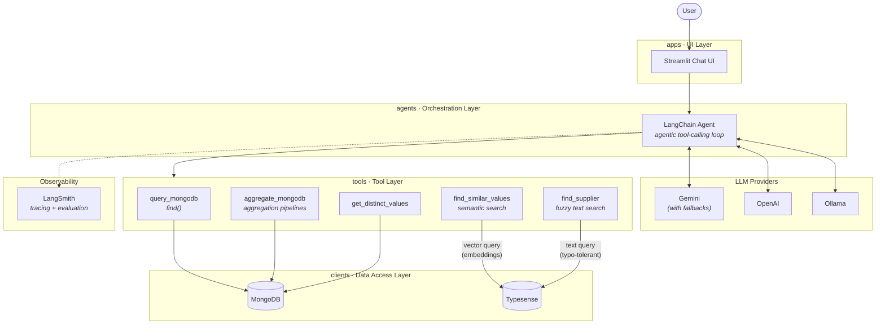

# AI Procurement Assistant

An AI-powered conversational assistant that answers natural language questions about California state procurement data (2012-2015). It interprets user queries, generates MongoDB queries and aggregation pipelines, executes them against real data, and returns clear, formatted answers.

Built with LangChain, Google Gemini, MongoDB, and Streamlit.

## Features

- **Natural language to database queries** — translates conversational questions into MongoDB `find()`, `aggregate()`, and `distinct()` operations automatically
- **Semantic search** — resolves informal names to exact database values via vector search (e.g. "Health Department" → "Health Care Services, Department of")
- **Fuzzy supplier search** — typo-tolerant text matching for proper nouns (e.g. "Pitney" → "Pitney Bowes")
- **Conversational interface** — Streamlit chat UI with message history and categorized example queries
- **Agentic tool use** — the LLM decides which tool to call, inspects results, and can chain multiple calls before answering
- **LLM fallback chain** — automatic failover to alternative Gemini models on rate limits or outages
- **LangSmith observability** — full trace trees with LLM inputs/outputs, tool calls, token counts, and latency

## Design Decisions

### Iterative development

The assistant was built incrementally, each layer addressing a real limitation discovered during testing:

1. **Basic agent** — LLM + MongoDB tools (`find`, `aggregate`, `distinct`). Works for exact queries but fails when users paraphrase field values.
2. **Semantic search** — Added vector search (Typesense + sentence-transformers) so the agent can resolve informal names like "Health Department" to exact DB values like "Health Care Services, Department of". This solved the concept-gap problem for categorical fields.
3. **Fuzzy supplier search** — During data exploration, we found that supplier names are proper nouns — "Pitney Bowes", "Delta Dental" — where semantic similarity doesn't help. "Pitney" and "Pitney Bowes" aren't conceptually related, they're just string-similar. Added Typesense text search with typo tolerance for these fields instead.
4. **LLM fallbacks** — Free-tier Gemini rate limits caused hard failures. Added `with_fallbacks()` so the agent automatically tries alternative models.
5. **Observability** — Integrated LangSmith for tracing every agent run end-to-end, enabling debugging of multi-step tool chains and regression testing.

### Technology choices

The project doubles as an exploration of specific tools, chosen for fit and learning value:

- **Typesense** over OpenSearch/Qdrant — a single lightweight binary that handles both vector search and typo-tolerant text search. OpenSearch is overkill (JVM, complex config) for ~40K distinct values. Qdrant handles vectors well but can't do fuzzy text, so we'd need a second system. Typesense covers both in one process.
- **LangChain** — provides a structured way to wire LLM tool-calling, message history, and fallback chains. The `with_fallbacks()` and `bind_tools()` patterns made the agent composable without custom retry logic.
- **LangSmith** — integrated for tracing and evaluation. Every agent run produces a full trace tree (LLM calls, tool arguments, results, latency). The `evaluate()` API runs eval cases as regression tests with scoring, so we can catch prompt or tool regressions before they ship.

Each of these was also an opportunity to evaluate the tool itself — understanding its strengths and limitations firsthand rather than relying on docs alone.

### Fuzzy vs semantic: driven by data

Not all fields benefit from the same search strategy. During exploration of the dataset, we identified two distinct categories:

| Strategy | Fields | Why |
|----------|--------|-----|
| **Semantic** (vector) | Department Name, Item Name, Acquisition Type, Acquisition Method | Users paraphrase with different words — "tech purchases" vs "IT Goods" |
| **Fuzzy** (text, typo-tolerant) | Supplier Name, Supplier Code, Supplier Zip Code | Proper nouns — arbitrary strings with no conceptual meaning |

This split is reflected in the indexing script (`scripts/index_typesense.py`), where semantic fields get vector embeddings and fuzzy fields get text-only indexing.

### Shared evaluation cases

`tests/evaluation.json` is a single source of truth for test cases, reused across:

- **Integration tests** — mocked LLM replays the expected tool calls against real MongoDB, verifying the full tool-dispatch path without API costs
- **Eval tests** — real LLM + real MongoDB via LangSmith `evaluate()`, measuring whether the agent independently arrives at correct answers
- **Regression** — adding a new eval case automatically creates both an integration test and a LangSmith regression check

### Test organization

Tests are organized by what they require to run:

```
tests/
├── unit_tests/          # No external dependencies. Fast, run everywhere.
├── integration_tests/   # Mocked LLM + real MongoDB. Tests tool dispatch and data flow.
└── eval_tests/          # Real LLM + real MongoDB + LangSmith. End-to-end accuracy.
```

This makes it easy to run the right level: `pytest tests/unit_tests/` in CI with no services, `pytest -m "not eval"` with just MongoDB, or `pytest -m eval` for full evaluation.

The emphasis on testing structure is deliberate — LLM-powered agents are non-deterministic, so guardrails matter more than in traditional software. Mocked integration tests verify the tool-dispatch plumbing is correct regardless of what the LLM generates, while eval tests check that the LLM actually produces the right tool calls and answers.

## Example Queries

**Exact match:**
- "How many orders were created in 2013?"
- "What are the top 10 most frequently ordered items?"
- "Total spending by department for fiscal year 2014-2015"

**Semantic search** (informal names resolved to exact DB values):
- "How many orders from the Health Department?"
- "What did Corrections buy the most?"

**Fuzzy supplier search** (typo-tolerant):
- "How much did Pitney spend in total?"
- "Show orders from Delat Dental"

## Architecture



### Project structure

```
src/
├── common/
│   └── config.py          # Environment configuration (dotenv)
├── clients/
│   ├── mongodb.py         # MongoDB connection, find/aggregate/distinct helpers
│   └── typesense.py       # Typesense search: vector (semantic) + text (fuzzy)
├── tools/
│   └── procurement.py     # LangChain @tool functions (query, aggregate, search)
├── agents/
│   └── procurement.py     # Agent orchestration, prompts, LLM builders, agentic loop
├── api/                   # FastAPI (placeholder)
└── apps/
    └── streamlit_app.py   # Chat UI

scripts/
├── load_data.py           # CSV → MongoDB loader with type conversions and indexes
└── index_typesense.py     # Index field values into Typesense (semantic + fuzzy)

tests/
├── evaluation.json                # Shared eval cases (integration + eval + regression)
├── conftest.py                    # Shared fixtures (MongoDB, mock LLM factory)
├── helpers.py                     # Test utilities
├── unit_tests/                    # Pure logic tests (no external deps)
├── integration_tests/             # Mocked LLM + real MongoDB
└── eval_tests/                    # Real LLM + real MongoDB via LangSmith
```

Dependency flow (downward only): `apps` → `agents/api` → `tools` → `clients` → `common`

## Setup

### Prerequisites

- Python 3.11+
- Docker (for MongoDB and Typesense)
- A Google Gemini API key
- (Optional) A LangSmith API key for observability

### 1. Start services

```bash
docker compose up -d
```

### 2. Install dependencies

```bash
python -m venv .venv
source .venv/bin/activate
pip install -e .
pip install -e ".[test]"          # for running tests
pip install -e ".[observability]" # for LangSmith
```

### 3. Configure environment

```bash
cp .env.example .env
# Edit .env with your API keys
```

### 4. Load data

Download the [California procurement dataset](https://www.kaggle.com/datasets/sohier/large-purchases-by-the-state-of-ca) and place the CSV in `data/lpca/`, then run:

```bash
python scripts/load_data.py
python scripts/index_typesense.py
```

### 5. Run the assistant

```bash
streamlit run src/apps/streamlit_app.py
```

## Running Tests

```bash
pytest tests/unit_tests/             # Unit tests only (no external deps)
pytest tests/integration_tests/      # Integration tests (needs MongoDB)
pytest -m "not eval"                 # Unit + integration (default CI mode)
pytest -m eval                       # Evaluation tests (needs MongoDB + Gemini + LangSmith)
```

## Tech Stack

| Component | Technology |
|-----------|-----------|
| LLM | Google Gemini (via LangChain) |
| Agent framework | LangChain with tool-calling |
| Database | MongoDB |
| Search | Typesense (vector + fuzzy text) |
| Embeddings | sentence-transformers (all-MiniLM-L6-v2) |
| UI | Streamlit |
| Observability | LangSmith |
| Testing | pytest |
